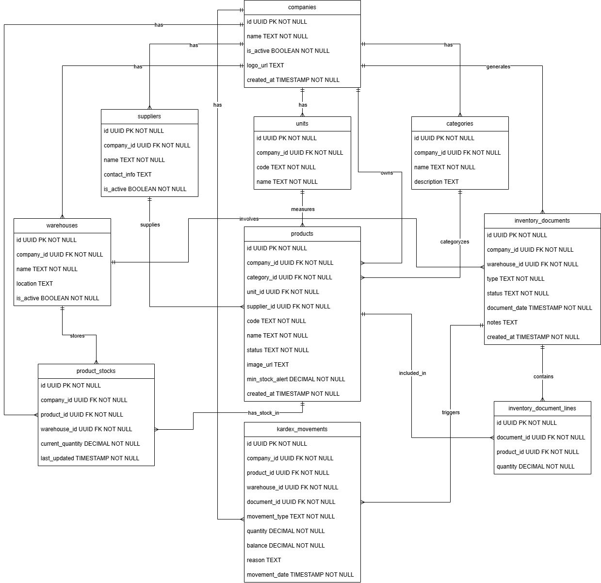

# Diagrama de Base de Datos - Sistema de Inventario (Semana 1 & 2)

A continuación se presenta el diagrama Entidad-Relación (ER) de la base de datos. Este esquema refleja los requerimientos extraídos de las historias de usuario de las Semanas 1 y 2, incorporando la arquitectura Multi-tenant (multi-empresa) y la persistencia estructurada mediante PostgreSQL.

### Justificación del Diseño:

1.  **Multi-tenant (US-01):** La tabla `COMPANIES` es el pilar. Casi todas las demás tablas tienen un `company_id` para garantizar que los datos estén aislados, cumpliendo con la necesidad de no mezclar inventarios y preparar el camino para el SaaS.
2.  **Dashboard y Vistas Rápidas (US-02, US-04, US-05, US-06):**
    *   La tabla `PRODUCT_STOCKS` actúa como una "fotografía" rápida del inventario actual por almacén, haciendo que las búsquedas de "Stock Actual" sean increíblemente rápidas (no necesitamos sumar o restar todo el historial del Kardex en cada carga).
    *   `PRODUCTS` guarda el `min_stock_alert` para generar las alertas en el dashboard.
3.  **Documentos Operativos (US-09 a US-14):**
    *   Las tablas `INVENTORY_DOCUMENTS` e `INVENTORY_DOCUMENT_LINES` manejan el patrón de "Cabecera - Detalle".
    *   Soportan el campo `status` ('BORRADOR', 'CONFIRMADO'). Mientras esté en borrador, no afecta el `PRODUCT_STOCKS` ni el `KARDEX_MOVEMENTS`.
4.  **Trazabilidad y Kardex (US-07, US-08, US-15):**
    *   La tabla `KARDEX_MOVEMENTS` es el registro contable e inmutable de movimientos de stock. 
    *   Cuenta con una relación directa (`document_id`) con el documento que lo generó (sea Entrada, Salida o Ajuste), garantizando **Trazabilidad estricta**.
    *   Guarda un `balance` en el momento del movimiento para fines de auditoría instantánea.
