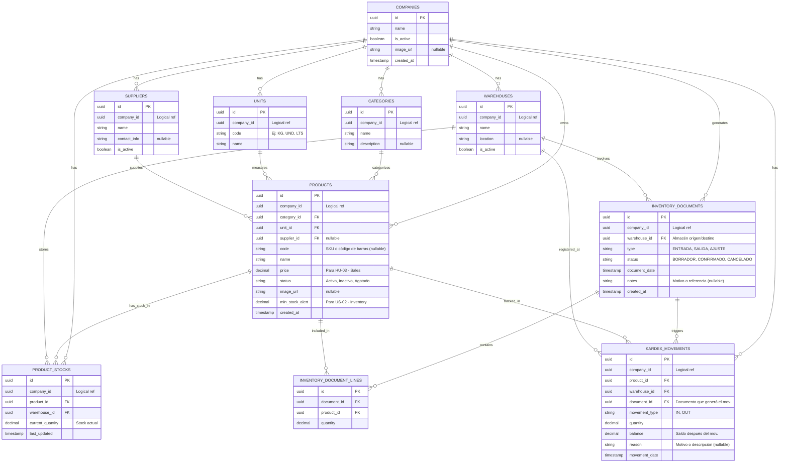

```mermaid
erDiagram

    %%-----------------------------------------

    %% Multi-tenant y Maestros

    %%-----------------------------------------

    COMPANIES {

        uuid id PK

        string name

        boolean is_active

        string image_url "nullable"

        timestamp created_at

    }

  

    CATEGORIES {

        uuid id PK

        uuid company_id "Logical ref"

        string name

        string description "nullable"

    }

  

    UNITS {

        uuid id PK

        uuid company_id "Logical ref"

        string code "Ej: KG, UND, LTS"

        string name

    }

  

    WAREHOUSES {

        uuid id PK

        uuid company_id "Logical ref"

        string name

        string location "nullable"

        boolean is_active

    }

  

    SUPPLIERS {

        uuid id PK

        uuid company_id "Logical ref"

        string name

        string contact_info "nullable"

        boolean is_active

    }

  

    %%-----------------------------------------

    %% Catálogo y Stock

    %%-----------------------------------------

    PRODUCTS {

        uuid id PK

        uuid company_id "Logical ref"

        uuid category_id FK

        uuid unit_id FK

        uuid supplier_id FK "nullable"

        string code "SKU o código de barras (nullable)"

        string name
        
        decimal price "Para HU-03 - Sales"

        string status "Activo, Inactivo, Agotado"

        string image_url "nullable"

        decimal min_stock_alert "Para US-02 - Inventory"

        timestamp created_at

    }

  

    PRODUCT_STOCKS {

        uuid id PK

        uuid company_id "Logical ref"

        uuid product_id FK

        uuid warehouse_id FK

        decimal current_quantity "Stock actual"

        timestamp last_updated

    }

  

    %%-----------------------------------------

    %% Operaciones y Trazabilidad (Kardex)

    %%-----------------------------------------

    INVENTORY_DOCUMENTS {

        uuid id PK

        uuid company_id "Logical ref"

        uuid warehouse_id FK "Almacén origen/destino"

        string type "ENTRADA, SALIDA, AJUSTE"

        string status "BORRADOR, CONFIRMADO, CANCELADO"

        timestamp document_date

        string notes "Motivo o referencia (nullable)"

        timestamp created_at

    }

  

    INVENTORY_DOCUMENT_LINES {

        uuid id PK

        uuid document_id FK

        uuid product_id FK

        decimal quantity

    }

  

    KARDEX_MOVEMENTS {

        uuid id PK

        uuid company_id "Logical ref"

        uuid product_id FK

        uuid warehouse_id FK

        uuid document_id FK "Documento que generó el mov."

        string movement_type "IN, OUT"

        decimal quantity

        decimal balance "Saldo después del mov."

        string reason "Motivo o descripción (nullable)"

        timestamp movement_date

    }

  

    %%-----------------------------------------

    %% Relaciones

    %%-----------------------------------------

    COMPANIES ||--o{ CATEGORIES : has

    COMPANIES ||--o{ UNITS : has

    COMPANIES ||--o{ WAREHOUSES : has

    COMPANIES ||--o{ SUPPLIERS : has

    COMPANIES ||--o{ KARDEX_MOVEMENTS : has

    COMPANIES ||--o{ PRODUCT_STOCKS : has

    COMPANIES ||--o{ PRODUCTS : owns

    COMPANIES ||--o{ INVENTORY_DOCUMENTS : generates

  

    CATEGORIES ||--o{ PRODUCTS : categorizes

    UNITS ||--o{ PRODUCTS : measures

    SUPPLIERS ||--o{ PRODUCTS : supplies

  

    PRODUCTS ||--o{ PRODUCT_STOCKS : has_stock_in

    WAREHOUSES ||--o{ PRODUCT_STOCKS : stores

  

    WAREHOUSES ||--o{ INVENTORY_DOCUMENTS : involves

    INVENTORY_DOCUMENTS ||--o{ INVENTORY_DOCUMENT_LINES : contains

    PRODUCTS ||--o{ INVENTORY_DOCUMENT_LINES : included_in

  

    INVENTORY_DOCUMENTS ||--o{ KARDEX_MOVEMENTS : triggers

    PRODUCTS ||--o{ KARDEX_MOVEMENTS : tracked_in

    WAREHOUSES ||--o{ KARDEX_MOVEMENTS : registered_at
```